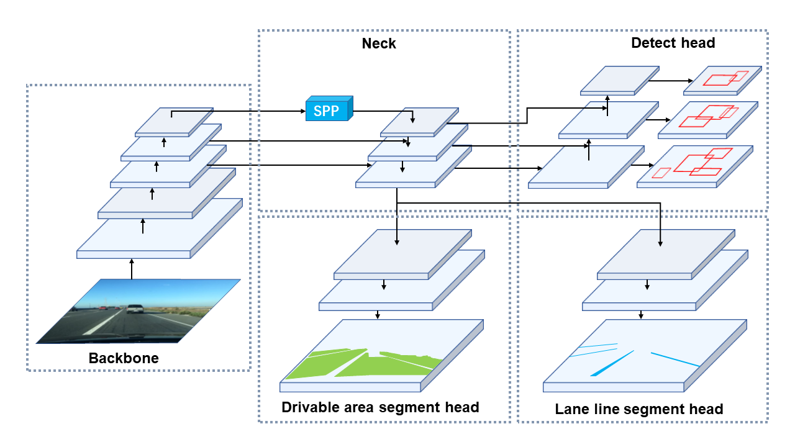
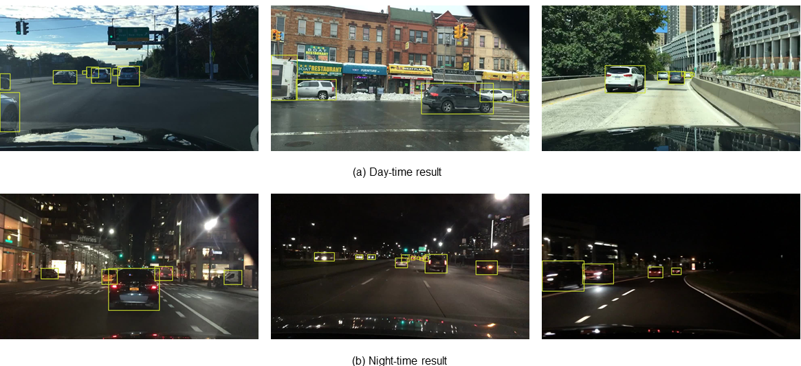
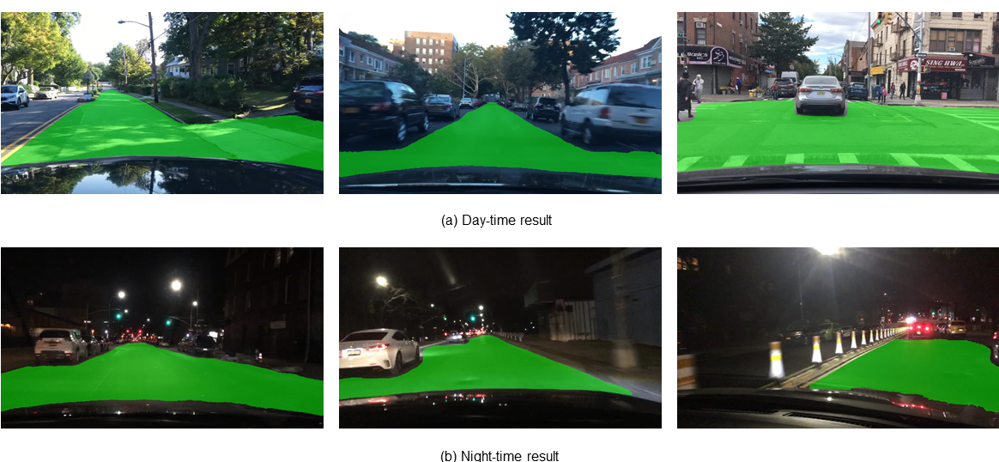

<div align="left">   

## You Only :eyes: Once for Panoptic ​ :car: Perception
> [**You Only Look at Once for Panoptic driving Perception**](https://arxiv.org/abs/2108.11250)
>
> by Dong Wu, Manwen Liao, Weitian Zhang, [Xinggang Wang](https://xinggangw.info/)<sup> :email:</sup>     [*School of EIC, HUST*](http://eic.hust.edu.cn/English/Home.htm)
>
>  (<sup>:email:</sup>) corresponding author.
>
> *arXiv technical report ([arXiv 2108.11250](https://arxiv.org/abs/2108.11250))*

---

[English Document](https://github.com/hustvl/YOLOP)

### YOLOP框架



### 贡献

* 我们提出了一种高效的多任务网络，该网络可以联合处理自动驾驶中的目标检测、可驾驶区域分割和车道检测三个关键任务。不但节省了计算成本，减少了推理时间，还提高了各个任务的性能。我们的工作是第一个在嵌入式设备上实现实时，同时在`BDD100K`数据集上保持`SOTA`（最先进的）性能水平。

* 我们设计了消融实验来验证我们的多任务方案的有效性。证明了这三个任务不需要繁琐的交替优化就可以联合学习。

* 我们设计了消融实验证明了基于网格的检测任务的预测机制与语义分割任务的预测机制更相关，相信这将为其他相关的多任务学习研究工作提供参考。  
  

### 实验结果

#### 交通目标检测结果：

| Model          | Recall(%) | mAP50(%) | Speed(fps) |
| -------------- | --------- | -------- | ---------- |
| `Multinet`     | 81.3      | 60.2     | 8.6        |
| `DLT-Net`      | 89.4      | 68.4     | 9.3        |
| `Faster R-CNN` | 77.2      | 55.6     | 5.3        |
| `YOLOv5s`      | 86.8      | 77.2     | 82         |
| `YOLOP(ours)`  | 89.2      | 76.5     | 41         |
#### 可行驶区域分割结果：

| Model         | mIOU(%) | Speed(fps) |
| ------------- | ------- | ---------- |
| `Multinet`    | 71.6    | 8.6        |
| `DLT-Net`     | 71.3    | 9.3        |
| `PSPNet`      | 89.6    | 11.1       |
| `YOLOP(ours)` | 91.5    | 41         |

#### 车道线检测结果:

| Model         | mIOU(%) | IOU(%) |
| ------------- | ------- | ------ |
| `ENet`        | 34.12   | 14.64  |
| `SCNN`        | 35.79   | 15.84  |
| `ENet-SAD`    | 36.56   | 16.02  |
| `YOLOP(ours)` | 70.50   | 26.20  |

#### 消融实验 1: 端对端训练 v.s. 分步训练:

| Training_method | Recall(%) | AP(%) | mIoU(%) | Accuracy(%) | IoU(%) |
| --------------- | --------- | ----- | ------- | ----------- | ------ |
| `ES-W`          | 87.0      | 75.3  | 90.4    | 66.8        | 26.2   |
| `ED-W`          | 87.3      | 76.0  | 91.6    | 71.2        | 26.1   |
| `ES-D-W`        | 87.0      | 75.1  | 91.7    | 68.6        | 27.0   |
| `ED-S-W`        | 87.5      | 76.1  | 91.6    | 68.0        | 26.8   |
| `End-to-end`    | 89.2      | 76.5  | 91.5    | 70.5        | 26.2   |

#### 消融实验 2: 多任务学习 v.s. 单任务学习:

| Training_method | Recall(%) | AP(%) | mIoU(%) | Accuracy(%) | IoU(%) | Speed(ms/frame) |
| --------------- | --------- | ----- | ------- | ----------- | ------ | --------------- |
| `Det(only)`     | 88.2      | 76.9  | -       | -           | -      | 15.7            |
| `Da-Seg(only)`  | -         | -     | 92.0    | -           | -      | 14.8            |
| `Ll-Seg(only)`  | -         | -     | -       | 79.6        | 27.9   | 14.8            |
| `Multitask`     | 89.2      | 76.5  | 91.5    | 70.5        | 26.2   | 24.4            |
  
#### 消融实验 3: 基于网格 v.s. 基于区域:

| Training_method | Recall(%) | AP(%) | mIoU(%) | Accuracy(%) | IoU(%) | Speed(ms/frame) |
| --------------- | --------- | ----- | ------- | ----------- | ------ | --------------- |
| `R-CNNP Det(only)`     | 79.0      | 67.3  |  -      | -           | -      | -            |
| `R-CNNP Seg(only)`     | -         | -     | 90.2    | 59.5        | 24.0   | -            |
| `R-CNNP Multitask`     | 77.2(-1.8)| 62.6(-4.7)| 86.8(-3.4)| 49.8(-9.7)| 21.5(-2.5)| 103.3            | 
| `YOLOP  Det(only)`     | 88.2      | 76.9  | -       | -           | -      | -            |
| `YOLOP  Seg(only)`     | -         | -     | 91.6    | 69.9        | 26.5   | -            |
| `YOLOP  Multitask`     | 89.2(+1.0)| 76.5(-0.4)| 91.5(-0.1)| 70.5(+0.6)| 26.2(-0.3)| 24.4            |   

**Notes**: 

- 我们工作参考了以下工作： `Multinet`  ([论文](https://arxiv.org/pdf/1612.07695.pdf?utm_campaign=affiliate-ir-Optimise%20media%28%20South%20East%20Asia%29%20Pte.%20ltd._156_-99_national_R_all_ACQ_cpa_en&utm_content=&utm_source=%20388939),[代码](https://github.com/MarvinTeichmann/MultiNet)）,`DLT-Net`   ([论文](https://ieeexplore.ieee.org/abstract/document/8937825)）,`Faster R-CNN`  ([论文](https://proceedings.neurips.cc/paper/2015/file/14bfa6bb14875e45bba028a21ed38046-Paper.pdf),[代码](https://github.com/ShaoqingRen/faster_rcnn)）,`YOLOv5`（[代码](https://github.com/ultralytics/yolov5))  ,`PSPNet`([论文](https://openaccess.thecvf.com/content_cvpr_2017/papers/Zhao_Pyramid_Scene_Parsing_CVPR_2017_paper.pdf),[代码](https://github.com/hszhao/PSPNet)) ,`ENet`([论文](https://arxiv.org/pdf/1606.02147.pdf),[代码](https://github.com/osmr/imgclsmob))    `SCNN`([论文](https://www.aaai.org/ocs/index.php/AAAI/AAAI18/paper/download/16802/16322),[代码](https://github.com/XingangPan/SCNN))    `SAD-ENet`([论文](https://openaccess.thecvf.com/content_ICCV_2019/papers/Hou_Learning_Lightweight_Lane_Detection_CNNs_by_Self_Attention_Distillation_ICCV_2019_paper.pdf),[代码](https://github.com/cardwing/Codes-for-Lane-Detection)). 感谢他们精彩的工作
- 在表 4中, E, D, S 和 W 分别代表 编码器（Encoder）, 检测头（Detect head）, 两个分割头（Segment heads）和整个网络（whole network）. 所以算法 (首先，我们只训练编码器和检测头。然后我们冻结编码器和检测头只训练两个分割头。最后，整个网络进行联合训练三个任务) 可以被记作 `ED-S-W`，以此类推。

---

### 可视化

#### 交通目标检测结果



#### 可行驶区域分割结果



#### 车道线分割结果


**注意点**: 

- 车道线分割结果是经过曲线拟合的.

---

### Project Structure

```python
├─inference
│ ├─images   # inference images
│ ├─output   # inference result
├─lib
│ ├─config/default   # configuration of training and validation
│ ├─core    
│ │ ├─activations.py   # activation function
│ │ ├─evaluate.py   # calculation of metric
│ │ ├─function.py   # training and validation of model
│ │ ├─general.py   #calculation of metric、nms、conversion of data-format、visualization
│ │ ├─loss.py   # loss function
│ │ ├─postprocess.py   # postprocess(refine da-seg and ll-seg, unrelated to paper)
│ ├─dataset
│ │ ├─AutoDriveDataset.py   # Superclass dataset，general function
│ │ ├─bdd.py   # Subclass dataset，specific function
│ │ ├─hust.py   # Subclass dataset(Campus scene, unrelated to paper)
│ │ ├─convect.py 
│ │ ├─DemoDataset.py   # demo dataset(image, video and stream)
│ ├─models
│ │ ├─YOLOP.py    # Setup and Configuration of model
│ │ ├─light.py    # Model lightweight（unrelated to paper, zwt)
│ │ ├─commom.py   # calculation module
│ ├─utils
│ │ ├─augmentations.py    # data augumentation
│ │ ├─autoanchor.py   # auto anchor(k-means)
│ │ ├─split_dataset.py  # (Campus scene, unrelated to paper)
│ │ ├─utils.py  # logging、device_select、time_measure、optimizer_select、model_save&initialize 、Distributed training
│ ├─run
│ │ ├─dataset/training time  # Visualization, logging and model_save
├─tools
│ │ ├─demo.py    # demo(folder、camera)
│ │ ├─test.py    
│ │ ├─train.py    
├─toolkits
│ │ ├─deploy    # Deployment of model
│ │ ├─datapre    # Generation of gt(mask) for drivable area segmentation task
├─weights    # Pretraining model
```

---

### Requirement

整个代码库是在 python 3.版本, PyTorch 1.7+版本和 torchvision 0.8+版本上开发的:

```
conda install pytorch==1.7.0 torchvision==0.8.0 cudatoolkit=10.2 -c pytorch
```

其他依赖库的版本要求详见`requirements.txt`：

```setup
pip install -r requirements.txt
```

### Data preparation

#### Download

- 从 [images](https://bdd-data.berkeley.edu/)下载图片数据集

- 从 [det_annotations](https://drive.google.com/file/d/1Ge-R8NTxG1eqd4zbryFo-1Uonuh0Nxyl/view?usp=sharing)下载检测任务的标签
- 从 [da_seg_annotations](https://drive.google.com/file/d/1xy_DhUZRHR8yrZG3OwTQAHhYTnXn7URv/view?usp=sharing)下载可行驶区域分割任务的标签
- 从 [ll_seg_annotations](https://drive.google.com/file/d/1lDNTPIQj_YLNZVkksKM25CvCHuquJ8AP/view?usp=sharing)下载车道线分割任务的标签

我们推荐按照如下图片数据集文件结构:

```
├─dataset root
│ ├─images
│ │ ├─train
│ │ ├─val
│ ├─det_annotations
│ │ ├─train
│ │ ├─val
│ ├─da_seg_annotations
│ │ ├─train
│ │ ├─val
│ ├─ll_seg_annotations
│ │ ├─train
│ │ ├─val
```

在 `./lib/config/default.py`下更新数据集的路径配置。

### 模型训练

你可以在 `./lib/config/default.py`设定训练配置. (包括:  预训练模型的读取，损失函数， 数据增强，optimizer，训练预热和余弦退火，自动anchor，训练轮次epoch, batch_size)


如果你想尝试交替优化或者单一任务学习，可以在`./lib/config/default.py` 中将对应的配置选项修改为 `True`。(如下，所有的配置都是 `False`, which means training multiple tasks end to end)。

```python
# Alternating optimization
_C.TRAIN.SEG_ONLY = False           # Only train two segmentation branchs
_C.TRAIN.DET_ONLY = False           # Only train detection branch
_C.TRAIN.ENC_SEG_ONLY = False       # Only train encoder and two segmentation branchs
_C.TRAIN.ENC_DET_ONLY = False       # Only train encoder and detection branch

# Single task 
_C.TRAIN.DRIVABLE_ONLY = False      # Only train da_segmentation task
_C.TRAIN.LANE_ONLY = False          # Only train ll_segmentation task
_C.TRAIN.DET_ONLY = False          # Only train detection task
```

开始训练:

```shell
python tools/train.py
```
多GPU训练:
```
python -m torch.distributed.launch --nproc_per_node=N tools/train.py  # N: the number of GPUs
```

### 模型评测

你可以在 `./lib/config/default.py`设定测试配置(包括： batch_size 以及  nms的阈值).

开始评测:

```shell
python tools/test.py --weights weights/End-to-end.pth
```


### Demo测试

我们提供两种测试方案

#### 

测试所使用的的图片存储在 `--source`下, 然后测试结果会保存在 `--save-dir`下：

```shell
python tools/demo.py --source inference/images
```


#### 相机实时

如果你的计算机连接了摄像头, 你可以将 `source` 设为摄像头的序号(默认值为 0).

```shell
python tools/demo.py --source 0
```


#### 展示

<table>
    <tr>
            <th>input</th>
            <th>output</th>
    </tr>
    <tr>
        <td></td>
        <td></td>
    </tr>
    <tr>
         <td></td>
        <td></td>
    </tr>
</table>


### 部署

我们的模型可以在 `Jetson Tx2`上 连接`Zed Camera` 实时推理。我们使用 `TensorRT` 工具进行推理加速。我们在  `./toolkits/deploy`提供模型部署和推理的全部代码。 


### 分割标签生成

你可以通过运行以下命令生成可行驶区域的Mask标签

```shell
python toolkits/datasetpre/gen_bdd_seglabel.py
```


## 引用

如果你发现我们的代码和论文对你的研究有帮助， 可以考虑给我们 star :star:   和引用 :pencil: :

```BibTeX
@article{wu2022yolop,
  title={Yolop: You only look once for panoptic driving perception},
  author={Wu, Dong and Liao, Man-Wen and Zhang, Wei-Tian and Wang, Xing-Gang and Bai, Xiang and Cheng, Wen-Qing and Liu, Wen-Yu},
  journal={Machine Intelligence Research},
  pages={1--13},
  year={2022},
  publisher={Springer}
}
```

